# ChronoKit

Zeitmess-App für Pebble. Kombiniert die beiden
offiziellen Pebble-Apps von Core Devices in einer App, erreichbar über ein
kleines Startmenü:

- **Stoppuhr** — Port von [coredevices/pebble-stopwatch](https://github.com/coredevices/pebble-stopwatch)
- **Timer** — Port von [coredevices/pebble-timer](https://github.com/coredevices/pebble-timer)
- **Zeitzone** — eigener Screen: zeigt die aktuell gesetzten Werte der Uhr und
  merkt sich auf Wunsch die jetzige Zone als Heimatzeit

Die Oberfläche folgt der **Sprache der Uhr** (Deutsch, Englisch, Französisch,
Italienisch und Spanisch, Englisch als Rückfall). Einen eigenen Sprachschalter gibt es bewusst nicht — siehe Abschnitt
[Sprachen](#sprachen).

## Unterstützte Geräte

| Plattform | Display | Besonderheit |
|---|---|---|
| `emery` | 200×228, Farbe, eckig | Referenzplattform (Pebble Time 2) |
| `flint` | 144×168, **schwarz-weiss**, eckig | Theme fällt auf Schwarz/Weiss zurück, halbes Speicherbudget |
| `gabbro` | 260×260, Farbe, **rund** | Auswahl mittig, Fortschritt als radiale Füllung |

## Bilder

### emery (200×228, Farbe, eckig)

| Startmenü | Stoppuhr | Pausiert | Timer stellen |
|:--:|:--:|:--:|:--:|
| 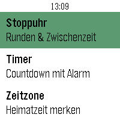 |  | 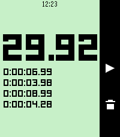 |  |

| Timer-Detail | Timer-Liste | Alarm |
|:--:|:--:|:--:|
| 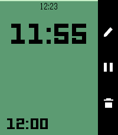 | 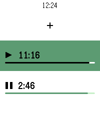 | 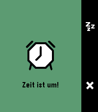 |

| Zeitzone, nichts gemerkt | Zeitzone, Heimat gesetzt |
|:--:|:--:|
| 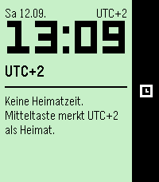 | 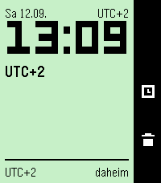 |

### flint (144×168, schwarz-weiss, eckig)

| Startmenü | Stoppuhr | Pausiert | Timer stellen |
|:--:|:--:|:--:|:--:|
| 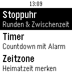 | 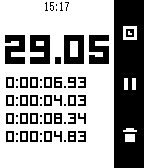 | 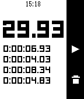 | 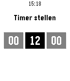 |

| Timer-Detail | Timer-Liste | Alarm |
|:--:|:--:|:--:|
| 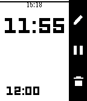 | 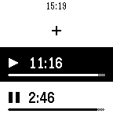 | 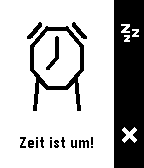 |

| Zeitzone, nichts gemerkt | Zeitzone, Heimat gesetzt |
|:--:|:--:|
| 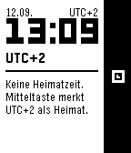 | 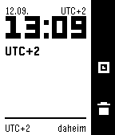 |

Auf flint ist die Fortschrittsfüllung weiss, sonst stünde die schwarze Zeit auf
schwarzem Grund. Sichtbar bleibt der Fortschritt durch die Linie an der Füllkante,
die auf Farbgeräten zusätzlich die Grenze zwischen den Grüntönen schärft.

### gabbro (260×260, Farbe, rund)

| Startmenü | Stoppuhr | Pausiert | Timer stellen |
|:--:|:--:|:--:|:--:|
| 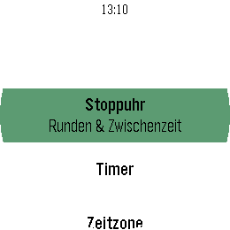 | 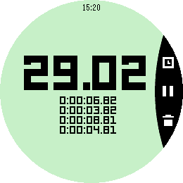 | 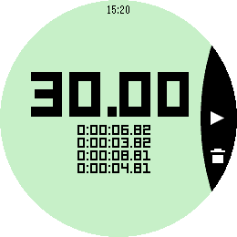 | 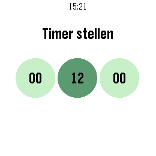 |

| Timer-Detail | Timer-Liste | Alarm |
|:--:|:--:|:--:|
| 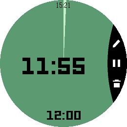 | 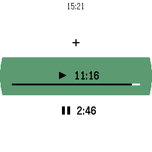 | 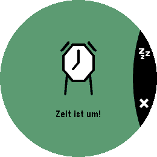 |

| Zeitzone, nichts gemerkt | Zeitzone, Heimat gesetzt |
|:--:|:--:|
| 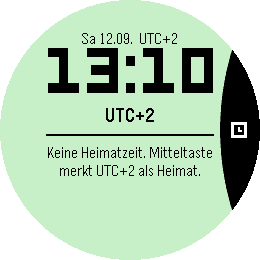 | 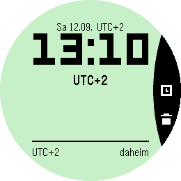 |

Alle Aufnahmen stammen aus dem Emulator in nativer Auflösung der jeweiligen
Plattform, aufgenommen mit demselben Ablauf und denselben Runden-Abständen.

## Bedienung

**Stoppuhr** (mintgrüner Screen, LECO-Ziffern, Action-Bar rechts)
- Mitte: Start / Pause
- Läuft: Oben = Runde, Unten = Reset
- Pausiert mit vielen Runden: Oben/Unten scrollt durch die Rundenliste
- Zeit skaliert automatisch; bis 22 Runden, Zustand bleibt beim Schliessen erhalten
- Die Rundenliste zeigt **Zwischenzeiten**: jede Zeile ist die Dauer seit der
  vorherigen Runde, nicht die Gesamtzeit. Die Werte steigen daher nicht an,
  neueste Runde steht oben. Die Gesamtzeit steht gross darüber.

**App Glance** (Eintrag im Launcher der Uhr)
- Der Launcher baut ihn einmal beim Beenden: laufender Timer zuerst, dann die
  Stoppuhr. Vorher schrieb jedes Modul den Glance selbst und überschrieb dabei
  den Eintrag des anderen (`app_glance_reload` löscht zuerst alle Einträge).
- Beide Module liefern nur den Text (`stopwatch_get_glance`,
  `timer_app_get_glance`), zusammengesetzt wird er in `chronokit.c`.

**Timer** (Mehrfach-Timer wie im Original)
- Liste mit «+» zum Anlegen; pro Timer Fortschrittsbalken und Play/Pause-Symbol
- «Timer stellen»: Stunden/Minuten/Sekunden-Felder (Oben/Unten ändern, Mitte weiter);
  kürzeste Dauer 1 Sekunde, mit 0 bricht man ab
- Detailansicht: grüne Füllung zeigt den Fortschritt; Action-Bar: Stift = Bearbeiten,
  Play/Pause, Papierkorb = Löschen
- Bei Ablauf: Vibration + animiertes «Zeit ist um!»-Popup mit Schlummern (1 Min)
  und Verwerfen — auch bei geschlossener App (Wakeup)
- Bis 8 Timer; Timer ≥ 15 Min erzeugen einen Timeline-Pin (via Handy-App)
- Der Pin geht seit 1.2.1 an `timeline-api.rebble.io`; der alte Host
  `timeline-api.getpebble.com` ist tot (löst auf 0.0.0.0 auf). Aufgefallen war
  das lange nicht, weil die Telefon-App von Core Devices **beide** Hosts unter
  `/v1/user/pins` selbst abfängt und den Pin lokal anlegt — der Aufruf verlässt
  das Telefon also ohnehin nicht. Ohne diesen Abfang (iPhone, klassische App,
  oder Einstellung «Emulate Timeline Webservice» aus) ging er bisher ins Leere.
- Seit 1.2.2 baut `makeTimerPin()` für jede Nachricht ein **eigenes**
  Pin-Objekt. Vorher war es ein einziges Modul-Objekt, das pro AppMessage
  umgeschrieben wurde — gesendet wird aber erst im asynchronen
  `getTimelineToken`-Callback. Startete man zwei Timer schnell hintereinander,
  trugen alle Anfragen den Inhalt der letzten Nachricht, während die URL noch
  die richtige ID hatte: Pin 22 bekam Titel, Restzeit und Launch-Code von
  Pin 11. `tools/pkjs_race_test.js` erzwingt genau diesen Ablauf und hält ihn
  fest (`node tools/pkjs_race_test.js src/pkjs/index.js`).

**Zeitzone** (eigener Screen, kein Port)

Oben stehen die **aktuell gesetzten Werte** der Uhr: Datum, UTC-Versatz, die
Ortszeit gross in LECO und der Ortsname. Unten die gemerkte **Heimatzeit** mit
dem Versatz zum aktuellen Standort. Der Untertitel der Menüzeile trägt die
Information schon selbst — «Heimatzeit merken», «Daheim: Zürich» oder unterwegs
«Zürich 21:37».

| Zustand | Oben | Mitte | Unten |
|---|---|---|---|
| Zone unbekannt | — | — | — |
| keine Heimat | — | merken | — |
| daheim | — | auffrischen | kurz: Hinweis · **lang: löschen** |
| unterwegs | +1 h | kurz: Hinweis · **lang: ersetzen** | −1 h |

Zwei Regeln stecken darin: ein **kurzer Druck ist nirgends zerstörend**, und
**gelöscht wird nur daheim** — unterwegs liesse sich die Heimatzone nicht
wiederherstellen, und ein zu lang gehaltenes «Unten» beim Korrigieren würde
genau das vernichten, wofür man den Screen geöffnet hat. Wo kein langer Druck
vorgesehen ist, wirkt er wie der kurze.

Ist es daheim **Nacht** (22–07 Uhr), wird der untere Block invertiert. Das
beantwortet «darf ich jetzt anrufen» ohne ein Wort.

**Sommerzeit.** Gespeichert wird der effektive UTC-Versatz im Moment des
Merkens — `tm_gmtoff` enthält die Sommerzeit bereits. Steht man wieder in der
Heimatzone, zieht die App den Wert stillschweigend nach; daheim stimmt er also
immer. Fällt der Umstellungstermin dagegen **in eine laufende Reise**, friert
der Versatz ein und die Heimatzeit geht eine Stunde falsch. Das ist keine
Nachlässigkeit: die Firmware hält nur das DST-Regelpaar der *aktuell gesetzten*
Zone, `timezone_database_*` ist nicht ans SDK exportiert, und eine fremde Zone
lässt sich auf der Uhr deshalb nicht auflösen. Dagegen gibt es die Handkorrektur
±1 h auf Oben/Unten (markiert das Delta mit `*`, langes Oben schaltet sie aus)
und ab 90 Tagen ohne Auffrischung ein `?` am Delta.

Eine Einschränkung noch: kennt die Firmware die Region nicht, liefert sie statt
`Europe/Zurich` den Ersatznamen `UTC+2`. Der ändert sich bei der Zeitumstellung
mit, und dann erkennt die App die Heimat nicht wieder — sie kann «gleicher Ort,
andere Jahreszeit» nicht von «eine Stunde westlich gereist» unterscheiden. Auf
einer mit dem Telefon gekoppelten Uhr kommt der Regionsname; im Emulator immer
der Ersatzname. Aus demselben Grund zeigen die Bilder oben `UTC+2` statt
`Zürich`.

## Sprachen

Die App liest beim Start `i18n_get_system_locale()` und folgt damit der
Einstellung der Uhr unter *Settings → Display → Language*. Ausgeliefert werden
**Englisch**, **Deutsch**, **Französisch**, **Italienisch** und **Spanisch**;
jede andere Uhrsprache bekommt Englisch.

| Deutsch | Englisch |
|:--:|:--:|
| 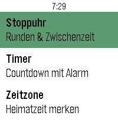 | 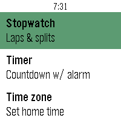 |

Alle Texte stehen in `src/c/strings_table.h`, eine Zeile je Text:

```
STR(STR_LAUNCHER_STOPWATCH, 0, "Stopwatch", "Stoppuhr", "Chronomètre", "Cronometro", "Cronómetro")
```

Die Datei wird zweimal eingebunden (X-Makro) — einmal für die Aufzählung der
Schlüssel, einmal für die Tabelle. Eine Zeile mit einer Spalte zu wenig ist
deshalb ein **Präprozessorfehler**, kein stiller Rückfall auf die falsche
Sprache. `S(STR_...)` liefert den Text; ein unbekannter Schlüssel oder eine
leere Spalte fällt auf Englisch zurück, statt abzustürzen.

Englisch ist Spalte 0 und Rückfall, weil die Pebble Time 2 Sprachen
mitbringt, für die wir keine Spalte haben (Català, Nederlands, Português,
Polski …) — eine deutsche Oberfläche auf einer polnischen Uhr wäre
schlechter als eine englische. In den übernommenen Screens trägt die
englische Spalte wörtlich die Originaltexte von Core Devices, damit ein
englisch eingestelltes ChronoKit dort ausgabegleich mit dem Original bleibt.

Die Spalten stehen in der Reihenfolge `en`, `de`, `fr`, `it`, `es`. Dieselbe
Nummer geht als `KEY_LANG` ans Telefon, das damit die Sprache des
Timeline-Pins wählt: 0 Englisch, 1 Deutsch, 2 Französisch, 3 Italienisch,
4 Spanisch. Eine ältere Telefonseite, die nur 0 und 1 kennt, fällt für die
neuen Nummern auf Englisch zurück.

Französisch, Italienisch und Spanisch sind knapp statt wörtlich übersetzt —
sie sind oft länger als Deutsch, die Zeilen auf der Uhr sind es nicht. Die
Heimatzeit heisst dort *Domicile* bzw. *Casa*, die Wochentage sind wie auf
Deutsch zwei Buchstaben. *AM*/*PM* bleiben in allen Sprachen stehen.

**Eine Sprache ergänzen:** in `strings.h` die Aufzählung `StringLang`
hinten erweitern, in `strings.c` den Zwei-Buchstaben-Vergleich ergänzen, in
`strings_table.h` eine Spalte anfügen. Verglichen wird nie auf `"de_DE"`, sondern
auf die ersten zwei Zeichen — ein Sprachpaket darf auch nur `"de"` liefern.

Zwei Dinge sind Sprache, aber kein Text, und stecken deshalb im Code: die
Reihenfolge im Datum (`12.09.` auf Deutsch, `12/09` auf Französisch,
Italienisch und Spanisch, `9/12` auf Englisch) und die Übersetzung von
Ortsnamen im Zeitzonen-Screen (`Zurich` → `Zürich`, `Zurigo`, `Zúrich`). Die
Tabelle `s_city` in `timezone_window.c` hat je Sprache eine Spalte; wo eine
Sprache den Ort wie Englisch schreibt, bleibt der Olson-Name stehen. Sie greift
**nie** auf Englisch — der Olson-Name der Uhr ist bereits die englische
Schreibweise. Reine Zonen wie `UTC+2` werden nicht übersetzt.

`node tools/strings_check.js` prüft, was der Compiler nicht sieht: leere
englische Spalte, doppelte Schlüssel, Überschreitung eines Zielpuffers in Bytes
(Umlaute zählen doppelt), zwischen den Sprachen abweichende Formatplatzhalter
und Schlüssel, die niemand mehr benutzt.

**Zum Testen:** Der Emulator meldet `en_US`, ein normaler Lauf zeigt also die
englische Oberfläche — damit ist der echte Weg über die API geprüft. Ein
Settings-App zum Umstellen hat dieser Emulator-Launcher nicht (nur ChronoKit
und Watchfaces). Für die deutsche Seite übersteuert man `strings_refresh()`
vorübergehend in der WSL-Kopie mit `prv_pick_language("de_DE")`, baut dort und
lässt die Windows-Quelle unangetastet. Nicht `setlocale()` benutzen: `strftime`
lokalisiert Wochentags- und Monatsnamen nur, solange App-Locale und
System-Locale übereinstimmen.

Auf einer echten **Pebble 2 Duo** (`flint`) sind die eingebauten Sprachkataloge
der Firmware abgeschaltet; dort meldet die Uhr dauerhaft `en_US` und ChronoKit
bleibt englisch, bis vom Telefon ein Sprachpaket installiert wird. Der
flint-Emulator verhält sich anders — ein grüner Test dort beweist für diese
Hardware nichts.

## Farbschema (Grün)

Alle Farben sind in `src/c/theme.h` zentralisiert:

- `ZM_COLOR_ACCENT` = GColorJaegerGreen (#00AA55): Menü-Hervorhebung und aktives Eingabefeld
- `ZM_COLOR_FILL` = GColorJaegerGreen: grossflächige Füllungen, die fremde Schrift tragen,
  also der Fortschritt im Timer-Detail und der Hintergrund der Popups
- `ZM_COLOR_SURFACE` = GColorMintGreen (#AAFFAA): getönte Flächen (Stoppuhr, oberer Teil des Timer-Details)
- `ZM_COLOR_ON_ACCENT` / `ZM_COLOR_ON_SURFACE` = `gcolor_legible_over(...)`: Schriftfarbe darauf

`ACCENT` und `FILL` sind auf Farbgeräten identisch und unterscheiden sich nur im
Schwarz-Weiss-Rückfall: `ACCENT` wird zu Schwarz, weil seine Schrift über
`ON_ACCENT` mitzieht, `FILL` dagegen zu Weiss, weil die Schrift darauf immer
schwarz ist. Genau daran krankte der erste Anlauf für flint.

Andere Grüntöne? Nur die beiden Defines ändern (Pebble-Palette: IslamicGreen, MayGreen, DarkGreen,
ScreaminGreen, MediumSpringGreen ...). Icons, PDC-Animationen und App-Icon sind rein schwarz/weiss
und brauchen keine Anpassung. Der Timeline-Pin (src/pkjs/index.js) nutzt ebenfalls #00AA55.

## Struktur

- `src/c/theme.h` — zentrale Farbpalette (siehe Farbschema oben)
- `src/c/common.h` — gemeinsame Zeiteinheiten, vorher in vier Dateien einzeln definiert
- `src/c/strings_table.h` + `strings.*` — alle Texte der Oberfläche, eine Zeile je
  Text (siehe Abschnitt Sprachen)
- `src/c/chronokit.c` — Launcher-Menü, bindet alle drei Module ein
- `src/c/timezone_window.*` — eigener Zeitzonen-Screen (kein Port). Zeichnet alles
  selbst, nutzt die LECO-Pfade aus `rendering.c` und die vorhandenen
  Action-Bar-Symbole, braucht also keine neue Ressource. Die Heimatzeit liegt
  unter den persist-Schlüsseln 200–204
- `src/c/stopwatch.c`, `rendering.*` — offizielle Stoppuhr (angepasst: kein eigenes `main`,
  Rundenzeit als einfache Differenz statt Modulo-Rechnung, `WindowData` wird beim
  Anlegen genullt, und `prv_get_epoch_ms` unterdrückt kleine Rückwärtssprünge:
  `time_ms()` liest Sekunden und Millisekunden nicht atomar, wodurch die Anzeige
  gelegentlich um knapp eine Sekunde zurücksprang)
- `src/c/timer_app.c` (ehem. `main.c`) + `menu/detail/setting/popup_window.*`,
  `selection_layer.*`, `countdown_timer.*`, `phone.*` — offizielle Timer-App
  (angepasst: Timer-Liste wird erst beim Öffnen gepusht, deutsche Texte, und die
  kürzeste Timerdauer von 5 auf 1 Sekunde gesenkt -- kürzere Eingaben wurden
  vorher wortlos verworfen)
- `resources/` — LECO-Fonts, Action-Bar-Icons, PDC-Animationen aus den Originalen

Der übernommene Code wurde in Version 1.1.2 um rund 40 % gekürzt, ohne das Verhalten zu
ändern: Zweige für nicht unterstützte Plattformen (aplite, basalt, chalk, diorite) und
immer wahre SDK-Bedingungen entfernt, ungenutzte Funktionen und Felder gestrichen,
doppelte Konstanten in `common.h` zusammengeführt, mehrfach kopierte Codepfade
(z. B. vier fast identische Animations-Konstruktoren) zu je einem Helfer verschmolzen,
und die seitenlangen Kommentarköpfe der Originale auf Einzeiler reduziert. Geprüft durch
Builds auf allen drei Plattformen, einen Bildvergleich gegen den vorherigen Stand und
eine unabhängige Durchsicht des Diffs mit Gegenprüfung jedes Befunds.

## Build (WSL, siehe auch Projekt-Memory)

```powershell
Copy-Item -Recurse -Force ".\src",".\resources",".\package.json" "\\wsl.localhost\Ubuntu\home\<wsl-benutzer>\chronokit\"
wsl -d Ubuntu -u <wsl-benutzer> -e sh -c "export PATH=`$HOME/.local/bin:`$PATH; cd ~/chronokit && pebble build && pebble install --emulator emery"
```

## Auf die echte Uhr

Pebble-App auf dem Handy → Developer Connection aktivieren, dann:

```powershell
wsl -d Ubuntu -u <wsl-benutzer> -e sh -c "export PATH=`$HOME/.local/bin:`$PATH; cd ~/chronokit && pebble install --phone <IP-DER-PEBBLE-APP>"
```

Werkzeuge: pebble-tool 5.0.40, SDK 4.33.1 (Python 3.13 via uv).

## Herkunft und Lizenz

Der Grossteil des C-Codes stammt aus den beiden offiziellen Apps (seit 1.1.2 gekuerzt und
bereinigt, siehe Abschnitt Struktur; die Logik ist unveraendert):

- `stopwatch.c`, `rendering.*` aus [coredevices/pebble-stopwatch](https://github.com/coredevices/pebble-stopwatch)
- `timer_app.c` (dort `main.c`), `menu/detail/setting/popup_window.*`, `selection_layer.*`,
  `countdown_timer.*`, `phone.*` sowie alle Dateien unter `resources/` aus
  [coredevices/pebble-timer](https://github.com/coredevices/pebble-timer), urspruenglich
  von Eric Phillips

Eigene Anteile: `chronokit.c` (Launcher), `timezone_window.*` (Zeitzonen-Screen, ab 1.2.0),
`strings.*` (Übersetzung, ab 1.3.0),
`theme.h` (Farbpalette), `common.h`, die deutschen Texte, die im Abschnitt Struktur
genannten Korrekturen und die Kürzung und Bereinigung ab 1.1.2. Der gekürzte Code bleibt
eine Bearbeitung der Originale.

**Lizenzlage:** Beide Quell-Repositories sind ohne Lizenzdatei veroeffentlicht (zuletzt
geprueft am 14.09.2026). Eine ausdrueckliche Nutzungsrechtseinraeumung fehlt daher, und
dieses Repository kann fuer den uebernommenen Code folglich auch keine Lizenz vergeben --
auch nicht fuer die eigenen Aenderungen daran, denn eine Bearbeitung bleibt an das
Original gebunden. Es liegt als oeffentliches Repository auf GitHub, wo die
Nutzungsbedingungen (Abschnitt D.5) das Ansehen und Forken oeffentlicher Repositories
abdecken. Wer den Code darueber hinaus verwenden will, sollte sich an Core Devices wenden.

[LICENSE](LICENSE) trennt beides auf: die davon unabhaengigen Dateien -- Starter,
Zeitzonen-Screen, Uebersetzung, Farbpalette, Hilfsskripte -- sind gemeinfrei (CC0 1.0),
fuer den uebernommenen Rest wird kein Recht eingeraeumt. Die Schwesterapps Drinktervall
und Flynformer sind Eigenentwicklungen und deshalb vollstaendig gemeinfrei. Reicht Core
Devices eine freie Lizenz nach, kann ChronoKit nachziehen.

## Store-Symbole

Der Appstore nimmt **nichts aus der `.pbw`**. Das `menuIcon` darin ist das
Symbol im Starter der Uhr; für die Store-Liste liegen im Entwicklerportal zwei
eigene Bilder, `icon_large` und `icon_small`. Ein Watchface braucht sie nicht,
eine Watchapp schon.

Angefordert werden sie in festen Massen — gross **80×80** und **144×144**,
klein **28×28** und **48×48** —, jeweils mit `exact` in der Adresse: die Masse
werden **erzwungen, nicht eingepasst**. Etwas Nicht-Quadratisches kommt verzogen
zurück. Das grosse Symbol legt der Store ausserdem für sein Teilen-Bild durch
eine abgerundete Maske — darum eine gefüllte Kachel und keine freistehende
Linie.

In [store/](store/) liegen `icon-144.png` und `icon-48.png`:

```bash
python3 tools/make_store_icon.py store
```

ChronoKit ist der eine Sonderfall: sein `system_icon.png` ist von Hand gesetzt
und hatte nie ein Werkzeug. Es nachträglich als Geometrie nachzubauen hätte ein
ausgeliefertes Symbol aufs Spiel gesetzt — trifft die Nachbildung einen Punkt
daneben, ändert sich das Symbol auf jeder Uhr, auf der die App schon liegt.
Darum rührt dieses Werkzeug die Bitmap nicht an und zeichnet nur die Kacheln.
Der Preis ist ehrlich zu nennen: die Stoppuhr steht damit zweimal da, einmal
als Punkte und einmal als Geometrie.

## Bauen

Auf GitHub baut jeder Push auf `main` die pbw neu, checkt sie ein und legt zu
einer neuen Fassung in `package.json` ein Release an — wie bei den
Schwesterapps (`.github/workflows/bauen.yml`). Die Notizen kommen aus
`.github/release/<fassung>.md`.
