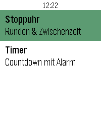
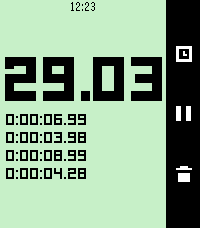
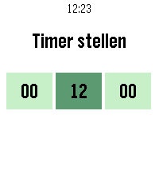

# ChronoKit

Zeitmess-App für die Pebble Time 2 (Plattform «emery»). Kombiniert die beiden
offiziellen Pebble-Apps von Core Devices in einer App, erreichbar über ein
kleines Startmenü:

- **Stoppuhr** — Port von [coredevices/pebble-stopwatch](https://github.com/coredevices/pebble-stopwatch)
- **Timer** — Port von [coredevices/pebble-timer](https://github.com/coredevices/pebble-timer)

## Bilder

| Startmenü | Stoppuhr | Pausiert | Timer stellen |
|:--:|:--:|:--:|:--:|
|  |  |  |  |

| Timer-Detail | Timer-Liste | Alarm |
|:--:|:--:|:--:|
|  |  |  |

Aufnahmen aus dem Emulator in nativer Auflösung 200×228.

## Bedienung

**Stoppuhr** (mintgrüner Screen, LECO-Ziffern, Action-Bar rechts)
- Mitte: Start / Pause
- Läuft: Oben = Runde, Unten = Reset
- Pausiert mit vielen Runden: Oben/Unten scrollt durch die Rundenliste
- Zeit skaliert automatisch; bis 22 Runden, Zustand bleibt beim Schliessen erhalten
- Die Rundenliste zeigt **Zwischenzeiten**: jede Zeile ist die Dauer seit der
  vorherigen Runde, nicht die Gesamtzeit. Die Werte steigen daher nicht an,
  neueste Runde steht oben. Die Gesamtzeit steht gross darüber.

**App Glance** (Eintrag im Launcher der Uhr)
- Der Launcher baut ihn einmal beim Beenden: laufender Timer zuerst, dann die
  Stoppuhr. Vorher schrieb jedes Modul den Glance selbst und überschrieb dabei
  den Eintrag des anderen (`app_glance_reload` löscht zuerst alle Einträge).
- Beide Module liefern nur den Text (`stopwatch_get_glance`,
  `timer_app_get_glance`), zusammengesetzt wird er in `chronokit.c`.

**Timer** (Mehrfach-Timer wie im Original)
- Liste mit «+» zum Anlegen; pro Timer Fortschrittsbalken und Play/Pause-Symbol
- «Timer stellen»: Stunden/Minuten/Sekunden-Felder (Oben/Unten ändern, Mitte weiter)
- Detailansicht: grüne Füllung zeigt den Fortschritt; Action-Bar: Stift = Bearbeiten,
  Play/Pause, Papierkorb = Löschen
- Bei Ablauf: Vibration + animiertes «Zeit ist um!»-Popup mit Schlummern (1 Min)
  und Verwerfen — auch bei geschlossener App (Wakeup)
- Bis 8 Timer; Timer ≥ 15 Min erzeugen einen Timeline-Pin (via Handy-App)

## Farbschema (Grün)

Alle Farben sind in `src/c/theme.h` zentralisiert:

- `ZM_COLOR_ACCENT` = GColorJaegerGreen (#00AA55): Menü-Hervorhebung, aktives Eingabefeld,
  Fortschritts-Füllung im Timer-Detail, Vollbild des «Zeit ist um!»-Popups
- `ZM_COLOR_SURFACE` = GColorMintGreen (#AAFFAA): getönte Flächen (Stoppuhr, oberer Teil des Timer-Details)
- `ZM_COLOR_ON_ACCENT` = `gcolor_legible_over(ACCENT)`: Schriftfarbe auf Akzent (bei JaegerGreen Schwarz)

Andere Grüntöne? Nur die beiden Defines ändern (Pebble-Palette: IslamicGreen, MayGreen, DarkGreen,
ScreaminGreen, MediumSpringGreen ...). Icons, PDC-Animationen und App-Icon sind rein schwarz/weiss
und brauchen keine Anpassung. Der Timeline-Pin (src/pkjs/index.js) nutzt ebenfalls #00AA55.

## Struktur

- `src/c/theme.h` — zentrale Farbpalette (siehe Farbschema oben)
- `src/c/chronokit.c` — Launcher-Menü, bindet beide Module ein
- `src/c/stopwatch.c`, `rendering.*` — offizielle Stoppuhr (angepasst: kein eigenes `main`,
  Rundenzeit als einfache Differenz statt Modulo-Rechnung, `WindowData` wird beim
  Anlegen genullt, und `prv_get_epoch_ms` unterdrückt kleine Rückwärtssprünge:
  `time_ms()` liest Sekunden und Millisekunden nicht atomar, wodurch die Anzeige
  gelegentlich um knapp eine Sekunde zurücksprang)
- `src/c/timer_app.c` (ehem. `main.c`) + `menu/detail/setting/popup_window.*`,
  `selection_layer.*`, `countdown_timer.*`, `phone.*` — offizielle Timer-App
  (angepasst: Timer-Liste wird erst beim Öffnen gepusht, deutsche Texte)
- `resources/` — LECO-Fonts, Action-Bar-Icons, PDC-Animationen aus den Originalen

## Build (WSL, siehe auch Projekt-Memory)

```powershell
Copy-Item -Recurse -Force ".\src",".\resources",".\package.json" "\\wsl.localhost\Ubuntu\home\<wsl-benutzer>\chronokit\"
wsl -d Ubuntu -u <wsl-benutzer> -e sh -c "export PATH=`$HOME/.local/bin:`$PATH; cd ~/chronokit && pebble build && pebble install --emulator emery"
```

## Auf die echte Uhr

Pebble-App auf dem Handy → Developer Connection aktivieren, dann:

```powershell
wsl -d Ubuntu -u <wsl-benutzer> -e sh -c "export PATH=`$HOME/.local/bin:`$PATH; cd ~/chronokit && pebble install --phone <IP-DER-PEBBLE-APP>"
```

Werkzeuge: pebble-tool 5.0.40, SDK 4.33.1 (Python 3.13 via uv).

## Herkunft und Lizenz

Der Grossteil des C-Codes stammt unveraendert aus den beiden offiziellen Apps:

- `stopwatch.c`, `rendering.*` aus [coredevices/pebble-stopwatch](https://github.com/coredevices/pebble-stopwatch)
- `timer_app.c` (dort `main.c`), `menu/detail/setting/popup_window.*`, `selection_layer.*`,
  `countdown_timer.*`, `phone.*` sowie alle Dateien unter `resources/` aus
  [coredevices/pebble-timer](https://github.com/coredevices/pebble-timer), urspruenglich
  von Eric Phillips

Eigene Anteile: `chronokit.c` (Launcher), `theme.h` (Farbpalette), die deutschen Texte
und die im Abschnitt Struktur genannten Korrekturen.

**Lizenzlage:** Beide Quell-Repositories sind ohne Lizenzdatei veroeffentlicht. Eine
ausdrueckliche Nutzungsrechtseinraeumung fehlt daher, und dieses Repository kann fuer den
uebernommenen Code folglich auch keine Lizenz vergeben. Es liegt als oeffentliches
Repository auf GitHub, wo die Nutzungsbedingungen (Abschnitt D.5) das Ansehen und Forken
oeffentlicher Repositories abdecken. Wer den Code darueber hinaus verwenden will, sollte
sich an Core Devices wenden.
